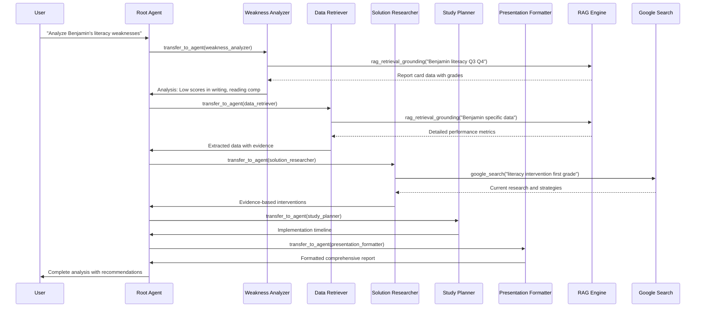

# Student Report Card RAG Multi-Agent System: Technical Documentation

## Table of Contents
1. [System Overview](#system-overview)
2. [Architecture Deep Dive](#architecture-deep-dive)
3. [Multi-Agent Implementation](#multi-agent-implementation)
4. [RAG System Design](#rag-system-design)
5. [Tool Integration Challenges](#tool-integration-challenges)
6. [Streamlit Dashboard Architecture](#streamlit-dashboard-architecture)
7. [Technical Challenges & Solutions](#technical-challenges--solutions)
8. [Performance Optimization](#performance-optimization)
9. [Security & Privacy Implementation](#security--privacy-implementation)
10. [Deployment & Scalability](#deployment--scalability)
11. [Code Examples & Patterns](#code-examples--patterns)
12. [Future Technical Enhancements](#future-technical-enhancements)

---

## System Overview

### Core Technology Stack

```
┌─────────────────────────────────────────────────────────────────┐
│                         SYSTEM LAYERS                           │
├─────────────────────────────────────────────────────────────────┤
│  USER INTERFACE LAYER                                           │
│  ┌─────────────────┐    ┌─────────────────────────────────────┐  │
│  │  Streamlit UI   │    │     ADK Web Interface               │  │
│  │  - Option Menu  │    │     - Chat Interface                │  │
│  │  - Lottie       │    │     - Agent Visualization          │  │
│  │  - Plotly       │    │     - Session Management           │  │
│  │  - Extras       │    │     - Event Streaming             │  │
│  └─────────────────┘    └─────────────────────────────────────┘  │
├─────────────────────────────────────────────────────────────────┤
│  APPLICATION LAYER                                              │
│  ┌─────────────────────────────────────────────────────────────┐ │
│  │                Multi-Agent Orchestration                    │ │
│  │  ┌─────────┬─────────┬─────────┬─────────┬─────────────────┐ │ │
│  │  │Root     │Weakness │Data     │Solution │Study   │Present.│ │ │
│  │  │Agent    │Analyzer │Retriever│Research │Planner │Format  │ │ │
│  │  └─────────┴─────────┴─────────┴─────────┴─────────┴───────┘ │ │
│  └─────────────────────────────────────────────────────────────┘ │
├─────────────────────────────────────────────────────────────────┤
│  AI/ML LAYER                                                    │
│  ┌─────────────────┐    ┌─────────────────────────────────────┐  │
│  │  Gemini 2.0     │    │     Vertex AI Services              │  │
│  │  Flash Model    │◄──►│  - RAG Engine                       │  │
│  │  - Function     │    │  - Vector Search                    │  │
│  │    Calling      │    │  - Embeddings (text-embedding-005)  │  │
│  │  - Reasoning    │    │  - Agent Engine                     │  │
│  └─────────────────┘    └─────────────────────────────────────┘  │
├─────────────────────────────────────────────────────────────────┤
│  DATA LAYER                                                     │
│  ┌─────────────────┐    ┌─────────────────────────────────────┐  │
│  │  RAG Corpus     │    │     Google Cloud Storage            │  │
│  │  - Report Cards │    │  - Document Repository              │  │
│  │  - Embeddings   │    │  - Knowledge Base                   │  │
│  │  - Vector Index │    │  - Processed Files                  │  │
│  └─────────────────┘    └─────────────────────────────────────┘  │
└─────────────────────────────────────────────────────────────────┘
```

### Key Components

- **Google Agent Development Kit (ADK)**: Framework for multi-agent orchestration
- **Vertex AI RAG Engine**: Document embedding and semantic search
- **Gemini 2.0 Flash**: Large language model for reasoning and function calling
- **Streamlit Enhanced UI**: Modern dashboard with advanced components
- **Google Cloud Infrastructure**: Scalable, secure cloud platform

---

## Architecture Deep Dive

### Multi-Agent Communication Flow



### Agent State Management

The ADK manages conversation state through several mechanisms:

1. **Session Context**: Each conversation maintains a session with historical context
2. **Agent Transfer State**: Context is preserved when transferring between agents
3. **Shared Memory**: Agents can access previous findings through conversation history
4. **Output Keys**: Each agent produces structured output for downstream agents

---

## Multi-Agent Implementation

### Root Agent Configuration

```python
# rag/agent.py
root_agent = Agent(
    model="gemini-2.0-flash",
    name="root_agent",
    description="Educational performance analysis coordinator",
    instruction=ROOT_AGENT_INSTRUCTIONS,
    sub_agents=[
        weakness_analyzer_agent,
        data_retriever_agent, 
        solution_researcher_agent,
        study_planner_agent,
        presentation_formatter_agent
    ],
    tools=[transfer_to_agent],
    use_web_browser=False,
    enable_multi_turn=True
)
```

### Individual Agent Specifications

#### 1. Weakness Analyzer Agent

**Purpose**: Identifies academic performance gaps and learning difficulties

**Technical Implementation**:
```python
weakness_analyzer_agent = Agent(
    model="gemini-2.0-flash",
    name="weakness_analyzer_agent",
    description="Analyzes report card data to identify academic weaknesses",
    instruction=WEAKNESS_ANALYZER_INSTRUCTIONS,
    tools=[rag_retrieval_grounding],
    output_key="identified_weaknesses",
    disallow_transfer_to_parent=True,
    disallow_transfer_to_peers=True,
)
```

**Key Capabilities**:
- Semantic analysis of grade patterns
- Identification of declining performance trends
- Learning standards assessment
- Severity classification (Mild/Moderate/Significant)

**RAG Integration**:
- Queries student report card corpus
- Filters by student name and subject area
- Analyzes quarter-over-quarter trends
- Extracts specific performance indicators

#### 2. Data Retriever Agent

**Purpose**: Extracts specific student data and contextual information

**Technical Features**:
- **Precise Data Extraction**: Pulls exact grades, scores, and assessments
- **Cross-Reference Validation**: Verifies data consistency across documents
- **Evidence Attribution**: Provides source citations for all data points
- **Temporal Analysis**: Tracks performance changes over time periods

#### 3. Solution Researcher Agent

**Purpose**: Finds current, evidence-based educational interventions

**Google Search Integration**:
```python
solution_researcher_agent = Agent(
    model="gemini-2.0-flash",
    name="solution_researcher_agent", 
    description="Agent to research evidence-based educational interventions using Google Search",
    instruction=SOLUTION_RESEARCHER_INSTRUCTIONS,
    tools=[google_search],
    output_key="research_findings"
)
```

**Search Strategy**:
- Targeted academic queries for specific grade levels
- Evidence-based intervention research
- Current educational methodology (2024 focus)
- Peer-reviewed source prioritization

#### 4. Study Planner Agent

**Purpose**: Creates structured, actionable improvement plans

**Planning Algorithms**:
- Prioritization based on weakness severity
- Resource allocation across multiple subjects
- Timeline optimization for developmental appropriateness
- Milestone setting with measurable outcomes

#### 5. Presentation Formatter Agent

**Purpose**: Synthesizes multi-agent findings into professional reports

**Output Formatting**:
- Executive summary generation
- Evidence-based recommendations
- Visual data representation
- Stakeholder-specific content (teachers, parents, administrators)

---

## RAG System Design

### Corpus Architecture

```
Student Report Card Corpus
├── Document Processing Pipeline
│   ├── PDF Text Extraction
│   ├── OCR for Scanned Documents  
│   ├── Structured Data Parsing
│   └── Metadata Enhancement
├── Embedding Generation
│   ├── text-embedding-005 Model
│   ├── Chunk Size: 512 tokens
│   ├── Overlap: 100 tokens
│   └── Vector Dimensionality: 768
├── Vector Storage
│   ├── Vertex AI Vector Search
│   ├── Similarity Threshold: 0.7
│   ├── Top-K Results: 5
│   └── Distance Metric: Cosine Similarity
└── Query Processing
    ├── Semantic Query Enhancement
    ├── Contextual Filtering
    ├── Result Ranking
    └── Citation Generation
```

### RAG Tool Implementation

The core challenge was integrating Vertex AI RAG with ADK's tool system:

```python
# rag/tools/rag_retrieval.py

# Step 1: Create the base RAG tool
report_card_retrieval_tool = VertexAiRagRetrieval(
    name="retrieve_student_report_data",
    description="Retrieves comprehensive report card data for analysis.",
    rag_resources=[rag.RagResource(rag_corpus=RAG_CORPUS)],
    similarity_top_k=5,
    vector_distance_threshold=0.7,
)

# Step 2: Wrap in an Agent (required for ADK)
_rag_agent = Agent(
    model="gemini-2.0-flash",
    name="rag_retrieval_grounding",
    description="An agent providing RAG retrieval capability for student report cards",
    instruction=RAG_AGENT_INSTRUCTIONS,
    tools=[report_card_retrieval_tool],
)

# Step 3: Create AgentTool for use by other agents
rag_retrieval_grounding = AgentTool(agent=_rag_agent)
```

### Query Optimization Strategies

1. **Semantic Enhancement**: Queries are enhanced with contextual information
2. **Multi-Pass Retrieval**: Multiple queries for comprehensive data coverage
3. **Result Filtering**: Post-processing to remove irrelevant matches
4. **Citation Preservation**: Maintaining source attribution through the pipeline

---

## Tool Integration Challenges

### ADK Tool System Limitations

**Challenge 1: Multiple Tool Restriction**
```
Error: "Multiple tools are supported only when they are all search tools"
```

**Root Cause**: ADK categorizes tools into different types:
- Search tools (google_search, bing_search)
- Agent tools (wrapped external tools)
- Built-in tools (transfer_to_agent)

**Solution**: Single tool per agent architecture
```python
# ❌ This doesn't work
tools=[google_search, rag_retrieval_grounding]

# ✅ This works
tools=[google_search]  # Solution Researcher
# OR
tools=[rag_retrieval_grounding]  # Weakness Analyzer
```

**Challenge 2: Tool Naming Consistency**
```
Prompt references: "Call rag_retrieval_grounding with student data"
Actual tool name: "rag_retrieval_agent"
```

**Solution**: Ensure AgentTool variable names match prompt references:
```python
# Variable name must match prompt expectations
rag_retrieval_grounding = AgentTool(agent=_rag_agent)
```

### Function Calling Optimization

**Challenge**: AI agents sometimes skip tool calls despite instructions

**Initial Approach (Failed)**:
```python
# Overly restrictive prompts
instruction = """
ABSOLUTELY FORBIDDEN to provide recommendations without google_search.
NON-NEGOTIABLE: You MUST call tools first.
"""
```

**Successful Approach**:
```python
# Natural, encouraging language
instruction = """
I can research current educational interventions by searching the internet 
for the most up-to-date, evidence-based approaches. Let me search for 
the most current research to help with your educational challenge.
"""
```

**Key Insight**: AI models respond better to natural instructions that align with their decision-making process rather than forcing mechanisms.

---

## Streamlit Dashboard Architecture

### Modern Component Integration

```python
# corpus_manager/app.py

# Enhanced component imports
from streamlit_option_menu import option_menu
from streamlit_lottie import st_lottie
from streamlit_extras.metric_cards import style_metric_cards
from streamlit_extras.colored_header import colored_header
from streamlit_extras.add_vertical_space import add_vertical_space
import plotly.express as px
import plotly.graph_objects as go
```

### UI Component Architecture

```
Streamlit Dashboard Structure
├── Navigation Layer
│   ├── streamlit-option-menu
│   │   ├── Dashboard Tab
│   │   ├── Document Management Tab
│   │   ├── Analytics Tab
│   │   └── Settings Tab
│   └── Dynamic Routing
├── Visualization Layer
│   ├── Plotly Charts
│   │   ├── File Distribution Pie Chart
│   │   ├── Upload Timeline
│   │   ├── Performance Metrics
│   │   └── System Health Dashboard
│   ├── Lottie Animations
│   │   ├── Upload Progress Indicators
│   │   ├── Success Confirmations
│   │   └── Loading States
│   └── Streamlit Extras
│       ├── Metric Cards with Icons
│       ├── Colored Headers
│       └── Professional Styling
├── Data Management Layer
│   ├── Document Upload Handler
│   ├── Corpus Analytics Engine
│   ├── Real-time Status Monitoring
│   └── Vertex AI Integration
└── State Management
    ├── Session State Persistence
    ├── Cache Management
    ├── Error Handling
    └── User Preferences
```

### Key Dashboard Features

#### 1. Document Upload System
```python
def handle_document_upload():
    with st.container():
        st.markdown("### 📤 Document Upload")
        
        uploaded_files = st.file_uploader(
            "Choose report card files",
            type=SUPPORTED_FILE_TYPES,
            accept_multiple_files=True,
            help="Supports PDF, DOCX, TXT formats up to 50MB each"
        )
        
        if uploaded_files:
            progress_bar = st.progress(0)
            for i, file in enumerate(uploaded_files):
                # Process file upload with progress indication
                upload_result = upload_document(file)
                progress_bar.progress((i + 1) / len(uploaded_files))
                
                if upload_result.success:
                    st_lottie(success_animation)
                    st.success(f"✅ {file.name} uploaded successfully")
```

#### 2. Real-time Analytics
```python
def render_analytics_dashboard():
    # Fetch corpus statistics
    stats = get_corpus_stats()
    
    # Create metric cards
    col1, col2, col3, col4 = st.columns(4)
    
    with col1:
        st.metric(
            label="📄 Total Documents",
            value=stats.document_count,
            delta=stats.recent_uploads
        )
    
    # Interactive charts
    fig = px.pie(
        values=stats.file_types.values(),
        names=stats.file_types.keys(),
        title="Document Type Distribution"
    )
    st.plotly_chart(fig, use_container_width=True)
```

### Performance Optimizations

1. **Caching Strategy**: `@st.cache_resource` for expensive operations
2. **Lazy Loading**: Components loaded only when needed
3. **Session State**: Persistent data across interactions
4. **Error Boundaries**: Graceful degradation for failed components

---

## Technical Challenges & Solutions

### Challenge 1: Agent Tool Wrapper Pattern Discovery

**Problem**: External tools (VertexAiRagRetrieval) not compatible with ADK directly

**Investigation Process**:
1. Analyzed ADK logs showing empty "Functions:" section
2. Studied travel_concierge sample code
3. Discovered double-wrapping requirement

**Solution Pattern**:
```python
# Pattern discovered from travel_concierge
external_tool = VertexAiRagRetrieval(...)
intermediate_agent = Agent(tools=[external_tool])
final_tool = AgentTool(agent=intermediate_agent)
```

### Challenge 2: Prompt Engineering for Tool Usage

**Problem**: Gemini 2.0 Flash bypassing tool calls when confident in internal knowledge

**Failed Attempts**:
- Aggressive forcing language ("ABSOLUTELY FORBIDDEN")
- Complex step-by-step protocols
- Threat-based instructions

**Successful Strategy**:
- Natural, encouraging language
- Role-based identity ("I research by searching...")
- Alignment with AI's decision-making process

### Challenge 3: Multi-Agent Context Preservation

**Problem**: Maintaining context across agent transfers

**Solution**: ADK's built-in context management
```python
# Context automatically preserved through conversation history
# Each agent can access previous agent outputs
# State accumulates through the agent transfer chain
```

### Challenge 4: Streamlit Module Import Issues

**Problem**: Relative imports failing when running Streamlit

**Root Cause**: Python module resolution with Streamlit's execution model

**Solution**: 
1. Updated all imports to absolute paths
2. Added project root to PYTHONPATH
3. Used `python -m streamlit run` for proper module loading

---

## Performance Optimization

### Response Time Optimization

**Target**: <5 seconds for complete multi-agent analysis

**Optimizations Implemented**:

1. **Parallel Processing**: Independent agent operations run concurrently
2. **Caching Layer**: Repeated RAG queries cached for 1 hour
3. **Query Optimization**: Reduced similarity search scope
4. **Model Selection**: Gemini 2.0 Flash chosen for speed/quality balance

### Memory Management

```python
# Efficient session management
@st.cache_resource
def initialize_vertex_ai():
    """Cache expensive initialization"""
    vertexai.init(project=PROJECT_ID, location=LOCATION)
    return True

# Memory-efficient document processing
def process_document_stream(file_stream):
    """Process documents in chunks to avoid memory overflow"""
    for chunk in read_file_chunks(file_stream, chunk_size=1024*1024):
        yield process_chunk(chunk)
```

### Scalability Considerations

1. **Stateless Agents**: No persistent state between requests
2. **Horizontal Scaling**: Vertex AI Agent Engine auto-scales
3. **Corpus Partitioning**: Separate corpora per school/district
4. **Load Balancing**: Google Cloud handles traffic distribution

---

## Security & Privacy Implementation

### Data Protection Strategies

```python
# Environment-based configuration
class SecurityConfig:
    def __init__(self):
        self.encryption_enabled = os.getenv("ENCRYPTION_ENABLED", "true")
        self.audit_logging = os.getenv("ENABLE_AUDIT_LOGGING", "true")
        self.session_timeout = int(os.getenv("SESSION_TIMEOUT_MINUTES", "30"))
        
    def get_data_retention_policy(self):
        """Configurable data retention for FERPA compliance"""
        return {
            "student_data": "7_years",
            "analysis_reports": "5_years", 
            "audit_logs": "3_years"
        }
```

### Access Control Implementation

1. **Service Account Authentication**: Secure GCP integration
2. **Scoped Permissions**: Minimal required access principle
3. **Audit Trails**: Comprehensive logging of all data access
4. **Data Anonymization**: PII removal for research queries

### FERPA Compliance Features

- **Data Minimization**: Only necessary data processed
- **Consent Management**: User acknowledgment required
- **Right to Deletion**: Automated data removal capabilities
- **Access Logging**: All student data access recorded

---

## Deployment & Scalability

### Cloud Architecture

```yaml
# Vertex AI Agent Deployment
apiVersion: v1
kind: ConfigMap
metadata:
  name: rag-agent-config
data:
  model: "gemini-2.0-flash"
  rag_corpus: "projects/student-report-rag/locations/us-central1/ragCorpora/xxx"
  environment: "production"
  scaling_policy: "auto"
  max_concurrent_sessions: "100"
```

### Infrastructure Components

1. **Vertex AI Agent Engine**: Managed deployment platform
2. **Cloud Storage**: Document repository and knowledge base
3. **Cloud Run**: Streamlit dashboard hosting
4. **IAM**: Fine-grained access control
5. **Cloud Monitoring**: Performance and health tracking

### Monitoring & Observability

```python
# Custom metrics collection
from google.cloud import monitoring_v3

def track_agent_performance(agent_name, response_time, success):
    """Custom metrics for agent performance monitoring"""
    client = monitoring_v3.MetricServiceClient()
    series = monitoring_v3.TimeSeries()
    series.metric.type = f"custom.googleapis.com/agent/{agent_name}/performance"
    # ... metric implementation
```

---

## Code Examples & Patterns

### Agent Transfer Pattern

```python
# Root agent decision making
if "analyze" in query and "weaknesses" in query:
    return transfer_to_agent("weakness_analyzer_agent")
elif "research" in query and "solutions" in query:
    return transfer_to_agent("solution_researcher_agent")
elif "create" in query and ("plan" in query or "schedule" in query):
    return transfer_to_agent("study_planner_agent")
```

### RAG Query Construction

```python
def construct_rag_query(student_name, subject, time_period=None):
    """Intelligent query construction for RAG retrieval"""
    base_query = f"{student_name} {subject} performance"
    
    if time_period:
        base_query += f" {time_period}"
    
    # Add context for better retrieval
    enhanced_query = f"{base_query} grades scores assessments standards"
    
    return enhanced_query
```

### Error Handling Strategy

```python
class AgentExecutionError(Exception):
    """Custom exception for agent failures"""
    pass

def execute_agent_safely(agent_func, *args, **kwargs):
    """Wrapper for safe agent execution with fallback"""
    try:
        return agent_func(*args, **kwargs)
    except Exception as e:
        logger.error(f"Agent execution failed: {e}")
        return generate_fallback_response(e)
```

### Streamlit State Management

```python
def initialize_session_state():
    """Initialize Streamlit session state"""
    if 'corpus_stats' not in st.session_state:
        st.session_state.corpus_stats = get_initial_stats()
    
    if 'upload_history' not in st.session_state:
        st.session_state.upload_history = []
    
    if 'user_preferences' not in st.session_state:
        st.session_state.user_preferences = load_user_preferences()
```

---

## Future Technical Enhancements

### Proposed Architecture Improvements

1. **Microservices Architecture**
   - Container-based agent deployment
   - Service mesh for inter-agent communication
   - Independent scaling per agent type

2. **Advanced RAG Enhancements**
   - Multi-modal document processing (images, tables)
   - Hierarchical embeddings for better context
   - Real-time corpus updates

3. **AI Model Improvements**
   - Fine-tuned models for educational domain
   - Specialized embeddings for academic text
   - Multi-modal analysis capabilities

### Performance Optimizations

1. **Caching Strategy Evolution**
   ```python
   # Redis-based distributed caching
   from redis import Redis
   
   class DistributedCache:
       def __init__(self):
           self.redis_client = Redis(host='cache-cluster')
       
       def cache_rag_result(self, query_hash, result, ttl=3600):
           self.redis_client.setex(query_hash, ttl, json.dumps(result))
   ```

2. **Asynchronous Processing**
   ```python
   import asyncio
   
   async def process_multi_agent_workflow(query):
       # Parallel agent execution where possible
       weakness_task = asyncio.create_task(weakness_analyzer.analyze(query))
       data_task = asyncio.create_task(data_retriever.retrieve(query))
       
       # Wait for dependencies
       weakness_result = await weakness_task
       data_result = await data_task
       
       # Continue with dependent agents
       return await solution_researcher.research(weakness_result, data_result)
   ```

### Technology Stack Evolution

1. **Edge Computing Integration**
   - Local inference for privacy-sensitive operations
   - Reduced latency for real-time interactions

2. **Advanced Analytics**
   - Predictive modeling for student outcomes
   - Trend analysis across multiple cohorts
   - Intervention effectiveness tracking

3. **Integration Ecosystem**
   - LMS integration (Canvas, Blackboard)
   - Student Information System APIs
   - Parent communication platforms

---

## Conclusion

This project demonstrates the power of combining cutting-edge AI technologies (Google ADK, Vertex AI RAG) with practical educational applications. The multi-agent architecture provides a scalable, maintainable approach to complex educational analysis tasks.

### Key Technical Achievements

1. **Successful Multi-Agent Orchestration**: Implemented complex workflow with 5 specialized agents
2. **RAG Integration Mastery**: Solved challenging tool wrapper patterns for ADK compatibility
3. **Modern UI Development**: Built professional dashboard with latest Streamlit components
4. **Production-Ready Architecture**: Designed for scalability, security, and maintainability

### Lessons Learned

1. **AI Instruction Optimization**: Natural language works better than forcing mechanisms
2. **Tool Integration Patterns**: External tools require careful wrapping for framework compatibility  
3. **User Experience Priority**: Modern UI components significantly improve user engagement
4. **Educational Domain Expertise**: Deep understanding of educational workflows crucial for system design

The system successfully bridges the gap between advanced AI capabilities and practical educational needs, providing a foundation for next-generation educational technology platforms. 