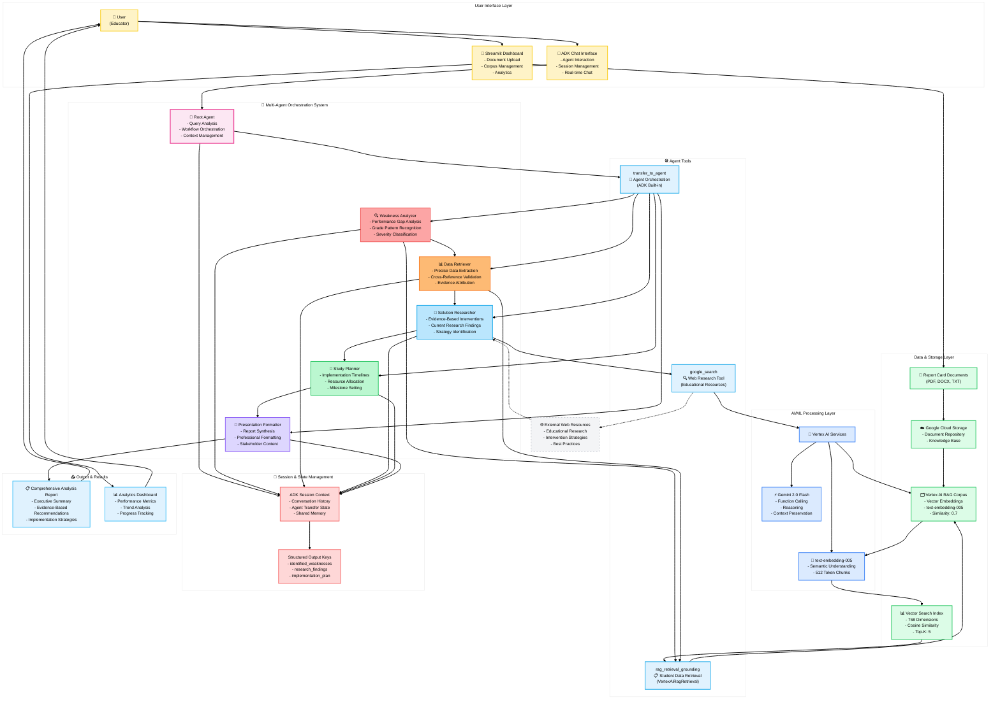
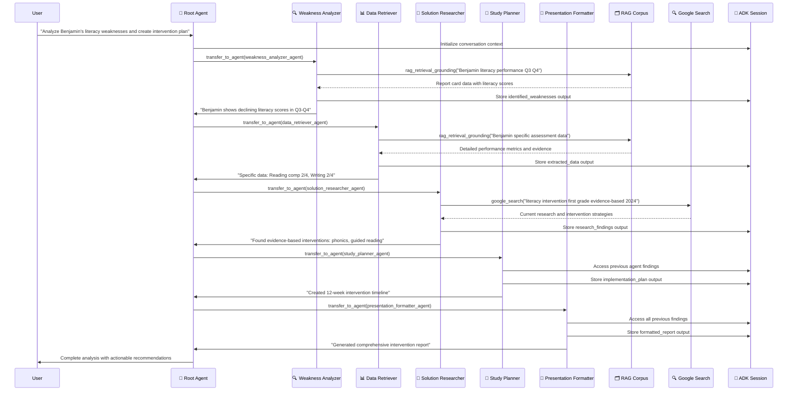
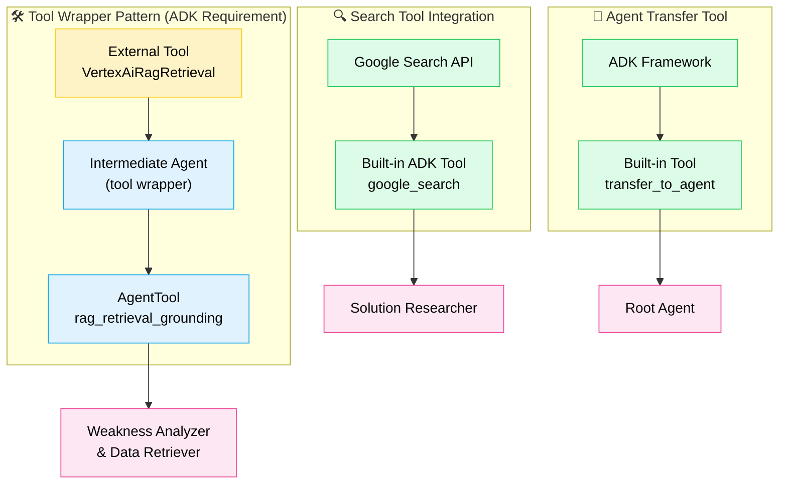

# Student Report Card RAG Multi-Agent System Architecture

```mermaid
---
config:
  theme: neo
  look: classic
  layout: fixed
---
flowchart TD
    subgraph UserInterface["User Interface Layer"]
        User["👤 User<br>(Educator)"]
        StreamlitUI["🎨 Streamlit Dashboard<br>- Document Upload<br>- Corpus Management<br>- Analytics"]
        ADKUI["🤖 ADK Chat Interface<br>- Agent Interaction<br>- Session Management<br>- Real-time Chat"]
    end

    subgraph DataLayer["Data & Storage Layer"]
        ReportCards["📄 Report Card Documents<br>(PDF, DOCX, TXT)"]
        CloudStorage["☁️ Google Cloud Storage<br>- Document Repository<br>- Knowledge Base"]
        RAGCorpus["🗂️ Vertex AI RAG Corpus<br>- Vector Embeddings<br>- text-embedding-005<br>- Similarity: 0.7"]
        VectorIndex["📊 Vector Search Index<br>- 768 Dimensions<br>- Cosine Similarity<br>- Top-K: 5"]
    end

    subgraph AIMLLayer["AI/ML Processing Layer"]
        VertexAI["🧠 Vertex AI Services"]
        GeminiFlash["⚡ Gemini 2.0 Flash<br>- Function Calling<br>- Reasoning<br>- Context Preservation"]
        EmbeddingModel["🔢 text-embedding-005<br>- Semantic Understanding<br>- 512 Token Chunks"]
    end

    subgraph Tools["🛠️ Agent Tools"]
        RAGTool["rag_retrieval_grounding<br>📋 Student Data Retrieval<br>(VertexAiRagRetrieval)"]
        GoogleSearch["google_search<br>🔍 Web Research Tool<br>(Educational Resources)"]
        TransferTool["transfer_to_agent<br>🔄 Agent Orchestration<br>(ADK Built-in)"]
    end

    subgraph MultiAgentSystem["🤖 Multi-Agent Orchestration System"]
        RootAgent["🎯 Root Agent<br>- Query Analysis<br>- Workflow Orchestration<br>- Context Management"]
        
        WeaknessAnalyzer["🔍 Weakness Analyzer<br>- Performance Gap Analysis<br>- Grade Pattern Recognition<br>- Severity Classification"]
        
        DataRetriever["📊 Data Retriever<br>- Precise Data Extraction<br>- Cross-Reference Validation<br>- Evidence Attribution"]
        
        SolutionResearcher["🔬 Solution Researcher<br>- Evidence-Based Interventions<br>- Current Research Findings<br>- Strategy Identification"]
        
        StudyPlanner["📅 Study Planner<br>- Implementation Timelines<br>- Resource Allocation<br>- Milestone Setting"]
        
        PresentationFormatter["📝 Presentation Formatter<br>- Report Synthesis<br>- Professional Formatting<br>- Stakeholder Content"]
    end

    subgraph SessionManagement["💾 Session & State Management"]
        ADKSession["ADK Session Context<br>- Conversation History<br>- Agent Transfer State<br>- Shared Memory"]
        OutputKeys["Structured Output Keys<br>- identified_weaknesses<br>- research_findings<br>- implementation_plan"]
    end

    subgraph OutputLayer["📤 Output & Results"]
        ComprehensiveReport["📋 Comprehensive Analysis Report<br>- Executive Summary<br>- Evidence-Based Recommendations<br>- Implementation Strategies"]
        VisualizationDashboard["📊 Analytics Dashboard<br>- Performance Metrics<br>- Trend Analysis<br>- Progress Tracking"]
    end

    %% User Interface Flows
    User --> StreamlitUI
    User --> ADKUI
    StreamlitUI --> ReportCards
    ADKUI --> RootAgent

    %% Data Processing Flows
    ReportCards --> CloudStorage
    CloudStorage --> RAGCorpus
    RAGCorpus --> EmbeddingModel
    EmbeddingModel --> VectorIndex
    VectorIndex --> RAGTool

    %% AI/ML Integration
    VertexAI --> GeminiFlash
    VertexAI --> RAGCorpus
    VertexAI --> EmbeddingModel

    %% Root Agent Orchestration
    RootAgent --> TransferTool
    TransferTool --> WeaknessAnalyzer
    TransferTool --> DataRetriever
    TransferTool --> SolutionResearcher
    TransferTool --> StudyPlanner
    TransferTool --> PresentationFormatter

    %% Agent Tool Usage
    WeaknessAnalyzer --> RAGTool
    DataRetriever --> RAGTool
    SolutionResearcher --> GoogleSearch
    RAGTool --> RAGCorpus
    GoogleSearch --> VertexAI

    %% Agent Workflow Sequence
    WeaknessAnalyzer --> DataRetriever
    DataRetriever --> SolutionResearcher
    SolutionResearcher --> StudyPlanner
    StudyPlanner --> PresentationFormatter

    %% Session & State Management
    RootAgent --> ADKSession
    WeaknessAnalyzer --> ADKSession
    DataRetriever --> ADKSession
    SolutionResearcher --> ADKSession
    StudyPlanner --> ADKSession
    PresentationFormatter --> ADKSession
    ADKSession --> OutputKeys

    %% Output Generation
    PresentationFormatter --> ComprehensiveReport
    StreamlitUI --> VisualizationDashboard
    ComprehensiveReport --> User
    VisualizationDashboard --> User

    %% External Integrations
    GoogleSearch -.-> ExternalWeb["🌐 External Web Resources<br>- Educational Research<br>- Intervention Strategies<br>- Best Practices"]
    ExternalWeb -.-> SolutionResearcher

    %% Styling Classes
    classDef userInterface fill:#fef3c7,stroke:#facc15,color:#000,stroke-width:2px
    classDef dataLayer fill:#dcfce7,stroke:#22c55e,color:#000,stroke-width:2px
    classDef aimlLayer fill:#dbeafe,stroke:#3b82f6,color:#000,stroke-width:2px
    classDef tools fill:#e0f2fe,stroke:#0ea5e9,color:#000,stroke-width:2px
    classDef rootAgent fill:#fce7f3,stroke:#ec4899,color:#000,stroke-width:3px
    classDef weaknessAgent fill:#fca5a5,stroke:#ef4444,color:#000,stroke-width:2px
    classDef dataAgent fill:#fdba74,stroke:#f97316,color:#000,stroke-width:2px
    classDef researchAgent fill:#bae6fd,stroke:#0ea5e9,color:#000,stroke-width:2px
    classDef planAgent fill:#bbf7d0,stroke:#22c55e,color:#000,stroke-width:2px
    classDef formatAgent fill:#ddd6fe,stroke:#8b5cf6,color:#000,stroke-width:2px
    classDef session fill:#fed7d7,stroke:#f56565,color:#000,stroke-width:2px
    classDef output fill:#e0f2fe,stroke:#38bdf8,color:#000,stroke-width:2px
    classDef external fill:#f3f4f6,stroke:#9ca3af,color:#000,stroke-width:1px,stroke-dasharray: 5 5

    %% Apply Classes
    class User,StreamlitUI,ADKUI userInterface
    class ReportCards,CloudStorage,RAGCorpus,VectorIndex dataLayer
    class VertexAI,GeminiFlash,EmbeddingModel aimlLayer
    class RAGTool,GoogleSearch,TransferTool tools
    class RootAgent rootAgent
    class WeaknessAnalyzer weaknessAgent
    class DataRetriever dataAgent
    class SolutionResearcher researchAgent
    class StudyPlanner planAgent
    class PresentationFormatter formatAgent
    class ADKSession,OutputKeys session
    class ComprehensiveReport,VisualizationDashboard output
    class ExternalWeb external
```

## Agent Workflow Sequence

```mermaid
sequenceDiagram
    participant User
    participant Root as 🎯 Root Agent
    participant WA as 🔍 Weakness Analyzer
    participant DR as 📊 Data Retriever
    participant SR as 🔬 Solution Researcher
    participant SP as 📅 Study Planner
    participant PF as 📝 Presentation Formatter
    participant RAG as 🗂️ RAG Corpus
    participant Google as 🔍 Google Search
    participant Session as 💾 ADK Session

    User->>Root: "Analyze Benjamin's literacy weaknesses and create intervention plan"
    Root->>Session: Initialize conversation context
    Root->>WA: transfer_to_agent(weakness_analyzer_agent)
    
    WA->>RAG: rag_retrieval_grounding("Benjamin literacy performance Q3 Q4")
    RAG-->>WA: Report card data with literacy scores
    WA->>Session: Store identified_weaknesses output
    WA->>Root: "Benjamin shows declining literacy scores in Q3-Q4"
    
    Root->>DR: transfer_to_agent(data_retriever_agent)
    DR->>RAG: rag_retrieval_grounding("Benjamin specific assessment data")
    RAG-->>DR: Detailed performance metrics and evidence
    DR->>Session: Store extracted_data output
    DR->>Root: "Specific data: Reading comp 2/4, Writing 2/4"
    
    Root->>SR: transfer_to_agent(solution_researcher_agent)
    SR->>Google: google_search("literacy intervention first grade evidence-based 2024")
    Google-->>SR: Current research and intervention strategies
    SR->>Session: Store research_findings output
    SR->>Root: "Found evidence-based interventions: phonics, guided reading"
    
    Root->>SP: transfer_to_agent(study_planner_agent)
    SP->>Session: Access previous agent findings
    SP->>Session: Store implementation_plan output
    SP->>Root: "Created 12-week intervention timeline"
    
    Root->>PF: transfer_to_agent(presentation_formatter_agent)
    PF->>Session: Access all previous findings
    PF->>Session: Store formatted_report output
    PF->>Root: "Generated comprehensive intervention report"
    
    Root->>User: Complete analysis with actionable recommendations
```

## Tool Integration Architecture

```mermaid
graph TD
    subgraph "🛠️ Tool Wrapper Pattern (ADK Requirement)"
        A["External Tool<br>VertexAiRagRetrieval"] --> B["Intermediate Agent<br>(tool wrapper)"]
        B --> C["AgentTool<br>rag_retrieval_grounding"]
    end
    
    subgraph "🔍 Search Tool Integration"
        D["Google Search API"] --> E["Built-in ADK Tool<br>google_search"]
    end
    
    subgraph "🔄 Agent Transfer Tool"
        F["ADK Framework"] --> G["Built-in Tool<br>transfer_to_agent"]
    end
    
    C --> H["Weakness Analyzer<br>& Data Retriever"]
    E --> I["Solution Researcher"]
    G --> J["Root Agent"]
    
    classDef external fill:#fef3c7,stroke:#facc15,color:#000
    classDef wrapper fill:#e0f2fe,stroke:#0ea5e9,color:#000
    classDef builtin fill:#dcfce7,stroke:#22c55e,color:#000
    classDef agent fill:#fce7f3,stroke:#ec4899,color:#000
    
    class A external
    class B,C wrapper
    class D,E,F,G builtin
    class H,I,J agent
``` 